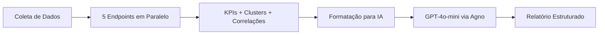

# 📊 Analytics API - Sistema de Análise de Dados GA4 & GSC

API completa de análise de dados com **Machine Learning** e **IA Generativa** para relatórios automáticos de marketing digital. Sistema pronto para produção com dados simulados ou reais do **Google Analytics 4 (GA4)** e **Google Search Console (GSC)**.

## 🌟 Destaques

- 🚀 **API REST completa** com FastAPI (13 endpoints)
- 🤖 **Relatórios com IA Generativa** (GPT-4o-mini via Agno)
- 📈 **Machine Learning** para clustering e análise preditiva
- 🎲 **Simulador de dados** realistas (50 dias, 3.668 registros)
- 💾 **DuckDB** para análise de alto desempenho
- 🔄 **Deploy automático** no Render
- 📚 **Documentação completa** para desenvolvimento frontend

## 🎯 Funcionalidades Principais

### 1️⃣ **Dashboard & KPIs**
- Total de páginas, sessões, conversões
- Taxa de conversão e bounce rate
- Duração média de sessão
- Matriz de correlação entre métricas

### 2️⃣ **Machine Learning (K-Means Clustering)**
- **Clusters de Canais**: Agrupa fontes de tráfego por performance
- **Clusters de Keywords**: Segmenta queries do GSC por comportamento
- **Clusters de Páginas**: Identifica padrões de engajamento

### 3️⃣ **Relatórios com IA Generativa** ⭐ **PRINCIPAL**
- Análise narrativa completa do período
- 5 seções estruturadas com insights
- 8-10 recomendações priorizadas (high/medium/low)
- Confidence score automático
- Geração em ~80 segundos

### 4️⃣ **Análise Detalhada**
- Performance de páginas específicas
- Simulador preditivo de métricas
- Dados brutos de todas as tabelas

### 5️⃣ **Administração**
- Populate database (gerar dados simulados)
- Database stats (estatísticas do banco)
- Health check

## 🚀 Quick Start

### 1. Instalação

```bash
# Clonar repositório
git clone https://github.com/GuOliv2306/trabalho_A2.git
cd trabalho_A2

# Criar ambiente virtual
python -m venv .venv
source .venv/bin/activate  # Linux/Mac
# ou
.venv\Scripts\activate     # Windows

# Instalar dependências
pip install -r requirements.txt
```

### 2. Configurar variáveis de ambiente

Crie um arquivo `.env` na raiz do projeto:

```env
# OpenAI API (para relatórios com IA)
OPENAI_API_KEY=sk-proj-...

# Chave de admin (qualquer string para proteger endpoints admin)
ADMIN_KEY=sua-chave-secreta-aqui
```

### 3. Iniciar a API

```bash
# Método 1: Script direto
python app/main.py

# Método 2: Via Uvicorn (com reload automático)
python -m uvicorn app.main:app --reload --port 8000
```

A API estará disponível em:
- 🌐 **API**: http://localhost:8000
- 📚 **Documentação**: http://localhost:8000/docs
- 🏥 **Health Check**: http://localhost:8000/api/v1/health

### 4. Popular o banco com dados simulados

```bash
curl -X POST "http://localhost:8000/api/v1/admin/populate-database" \
  -H "Content-Type: application/json" \
  -d '{
    "days": 50,
    "overwrite": true,
    "admin_key": "sua-chave-secreta-aqui"
  }'
```

Isso vai gerar:
- ✅ 50 dias de dados simulados
- ✅ 3.668 registros realistas
- ✅ 4 tabelas: traffic, engagement, conversions, gsc_query_performance

### 5. Gerar relatório com IA

```bash
curl -X POST "http://localhost:8000/api/v1/reports/generate" \
  -H "Content-Type: application/json" \
  -d '{
    "period_days": 7,
    "detail_level": "executive"
  }'
```

Retorna um relatório completo com:
- 📝 Executive summary
- 📊 5 seções analíticas
- 🎯 8-10 recomendações priorizadas

## � API Endpoints (10 endpoints para frontend)

### 🏥 Health Check
```http
GET /api/v1/health
```

### 📊 Dashboard & KPIs
```http
GET /api/v1/overview/kpis
# Retorna: totalPaginas, sessoesTotais, conversoesTotais, mediaBounceRate, mediaSessionDuration
```

### 📈 Análises Estáticas
```http
GET /api/v1/analysis/correlation_matrix
# Matriz de correlação entre métricas
```

### 🤖 Machine Learning (K-Means)
```http
GET /api/v1/ml/channel_clusters?n_clusters=3
# Clusters de canais de tráfego

GET /api/v1/ml/keyword_clusters?n_clusters=3
# Clusters de keywords (GSC)

GET /api/v1/ml/page_clusters?n_clusters=3
# Clusters de páginas por engajamento
```

### 🔍 Análises Preditivas
```http
GET /api/v1/page_analysis?path=/produtos/item-1
# Análise detalhada de página específica

POST /api/v1/predict/simulator
# Body: { "sessions": 1000, "bounce_rate": 0.3, "avg_duration": 120 }
# Retorna: predição de conversões, engajamento, recomendações
```

### 📄 Visualização de Dados
```http
GET /api/v1/data/all?limit=50
# Todos os dados de todas as tabelas

GET /api/v1/data/summary
# Estatísticas resumidas do banco
```

### ⭐ Relatórios com IA Generativa
```http
POST /api/v1/reports/generate
# Body: { "period_days": 7, "detail_level": "executive" }
# Gera relatório completo com GPT-4o-mini
```

**📚 Documentação completa:** Ver [`docs/DOCUMENTACAO_API_PARA_FRONTEND.md`](docs/DOCUMENTACAO_API_PARA_FRONTEND.md)

## 🎲 Simulador de Dados

O sistema inclui um simulador completo de dados realistas para testes:

```bash
# Gerar 50 dias de dados (via API)
curl -X POST "http://localhost:8000/api/v1/admin/populate-database" \
  -H "Content-Type: application/json" \
  -d '{"days": 50, "overwrite": true, "admin_key": "sua-chave"}'

# Ou via script Python
python tests/simulador_dados.py --days 50 --clear

# Visualizar dados gerados
python tests/visualizar_dados.py
```

### Dados Gerados (50 dias)

| Tabela | Registros | Descrição |
|--------|-----------|-----------|
| `traffic` | 1.150 | Tráfego por canal (source/medium) |
| `engagement` | 1.250 | Engajamento por página |
| `conversions` | 900 | Eventos de conversão |
| `gsc_query_performance` | 368 | Performance de keywords |
| **TOTAL** | **3.668** | Registros realistas |

**Características:**
- ✅ Distribuições estatísticas realistas (Poisson, Normal, Beta)
- ✅ Padrões temporais (fins de semana vs dias úteis)
- ✅ Correlações entre métricas (bounce vs duration)
- ✅ Variação por canal (organic, paid, social, etc.)

## 🗄️ Banco de Dados (DuckDB)

### Schema Principal

| Tabela | Descrição | Campos Principais |
|--------|-----------|-------------------|
| **traffic** | Tráfego por canal | date, session_source, session_medium, sessions, active_users, new_users, screen_page_views, average_session_duration |
| **engagement** | Engajamento por página | date, page_path, engagement_rate, engaged_sessions, event_count, average_session_duration |
| **conversions** | Eventos de conversão | date, event_name, session_source, key_events, event_count, total_revenue, transactions |
| **gsc_query_performance** | Performance de keywords | date, query, clicks, impressions, ctr, position |

### Queries de Exemplo

```python
from src.collectors.db_storage import GA4DatabaseStorage

db = GA4DatabaseStorage()

# Top páginas mais visitadas
result = db.query_df("""
    SELECT 
        page_path,
        SUM(screen_page_views) as total_views,
        AVG(engagement_rate) as avg_engagement
    FROM engagement
    GROUP BY page_path
    ORDER BY total_views DESC
    LIMIT 10
""")

# Receita por fonte
result = db.query_df("""
    SELECT 
        session_source,
        session_medium,
        SUM(total_revenue) as revenue,
        SUM(key_events) as conversions
    FROM conversions
    GROUP BY session_source, session_medium
    ORDER BY revenue DESC
""")

# Top keywords
result = db.query_df("""
    SELECT 
        query,
        SUM(clicks) as total_clicks,
        AVG(position) as avg_position
    FROM gsc_query_performance
    GROUP BY query
    ORDER BY total_clicks DESC
    LIMIT 20
""")

db.close()
```

## 🤖 Relatórios com IA Generativa

### Como Funciona

O sistema usa **Agno** (framework para agentes de IA) + **GPT-4o-mini** para gerar relatórios analíticos automáticos:



### Endpoints Coletados Automaticamente

1. **KPIs**: Sessões, conversões, bounce rate, duração média
2. **Channel Clusters**: 3 clusters de canais por performance (K-Means)
3. **Keyword Clusters**: 3 clusters de keywords (K-Means)
4. **Page Clusters**: 3 clusters de páginas por engajamento (K-Means)
5. **Correlations**: Matriz de correlação entre métricas

### Estrutura do Relatório

```json
{
  "executive_summary": "Resumo executivo do período...",
  "sections": [
    {
      "title": "Seção 1 — Visão Geral de Performance",
      "content": "Análise narrativa...",
      "key_insights": [
        "Insight 1",
        "Insight 2",
        "Insight 3"
      ]
    },
    // ... mais 4 seções
  ],
  "recommendations": [
    {
      "priority": "high",
      "category": "conversions",
      "action": "Auditar tracking...",
      "rationale": "Justificativa baseada em dados..."
    },
    // ... 7-10 recomendações
  ]
}
```

### Performance

- ⏱️ **Tempo de geração**: ~80 segundos
- 📊 **Tokens consumidos**: ~7.400 tokens (input + output)
- 💰 **Custo aproximado**: ~$0.001 por relatório (GPT-4o-mini)
- ✅ **Confidence Score**: Calculado automaticamente (0.0 - 1.0)

### Exemplo de Uso

```bash
curl -X POST "http://localhost:8000/api/v1/reports/generate" \
  -H "Content-Type: application/json" \
  -d '{
    "period_days": 30,
    "detail_level": "detailed",
    "focus_areas": ["traffic", "conversions"]
  }'
```

## 🏗️ Estrutura do Projeto

```
trabalho_A2/
├── app/
│   ├── main.py                  # FastAPI - 13 endpoints
│   ├── report_models.py         # Pydantic models + formatação
│   ├── report_agent.py          # Agente Agno para IA
│   └── start_api.sh             # Script para iniciar API
├── src/
│   ├── collectors/
│   │   ├── db_storage.py        # DuckDB storage + queries
│   │   ├── ga_orchestrator.py  # Orchestrator GA4
│   │   └── gsc_orchestrator.py # Orchestrator GSC
│   ├── ml/
│   │   ├── channel_profiling.py    # K-Means para canais
│   │   ├── keyword_clustering.py   # K-Means para keywords
│   │   └── page_segmentation.py    # K-Means para páginas
│   ├── cleaning/                # Limpeza e validação
│   └── ga/ & gsc/               # Clientes das APIs
├── data/
│   ├── raw/                     # JSONs coletados
│   └── processed/
│       └── ga4_data.duckdb      # Banco DuckDB principal
├── tests/
│   ├── simulador_dados.py       # Gerador de dados realistas
│   └── visualizar_dados.py      # Visualização no terminal
├── docs/
│   ├── DOCUMENTACAO_API_PARA_FRONTEND.md  # Docs completa API
│   ├── PROMPT_PARA_GERAR_FRONTEND.md      # Prompt para IA gerar frontend
│   └── [outros docs...]
├── requirements.txt             # Dependências Python
├── .env                         # Variáveis de ambiente
└── README.md
```

## � Deploy em Produção

### Render (Atual)

A API está em produção no Render:

- 🌐 **URL**: https://siteup.onrender.com
- 📚 **Docs**: https://siteup.onrender.com/docs
- 🏥 **Health**: https://siteup.onrender.com/api/v1/health

### Deploy Manual

```bash
# 1. Configurar variáveis de ambiente no Render
OPENAI_API_KEY=sk-proj-...
ADMIN_KEY=sua-chave-secreta

# 2. Configurar build
# Build Command: pip install -r requirements.txt
# Start Command: python app/main.py

# 3. Deploy automático via GitHub
git push origin main
```

### Variáveis de Ambiente Necessárias

| Variável | Obrigatória | Descrição |
|----------|-------------|-----------|
| `OPENAI_API_KEY` | ✅ Sim | Para relatórios com IA |
| `ADMIN_KEY` | ✅ Sim | Proteção de endpoints admin |
| `PORT` | ❌ Não | Render define automaticamente |

## �️ Stack Tecnológico

| Categoria | Tecnologia | Versão |
|-----------|-----------|--------|
| **Backend** | FastAPI | 0.115+ |
| **IA** | OpenAI GPT-4o-mini | Latest |
| **Framework IA** | Agno | Latest |
| **ML** | scikit-learn | 1.3+ |
| **Database** | DuckDB | 1.1+ |
| **Data Processing** | pandas, numpy | Latest |
| **Validação** | Pydantic | 2.0+ |
| **Deploy** | Render | - |

## 📚 Documentação Completa

- 📖 **[API Documentation](docs/DOCUMENTACAO_API_PARA_FRONTEND.md)** - Documentação completa dos 10 endpoints para frontend
- 🎨 **[Frontend Generation Prompt](docs/PROMPT_PARA_GERAR_FRONTEND.md)** - Prompt otimizado para IA gerar o frontend
- 📊 **[Estado do Projeto](docs/ESTADO_ATUAL_PROJETO.md)** - Status atual e próximos passos
- 🔍 **[Exemplos de Requisições](docs/EXEMPLOS_REQUISICOES.md)** - Exemplos práticos de uso da API

## 🎯 Casos de Uso

### 1. Dashboard Executivo
- KPIs principais em tempo real
- Visualização de clusters de canais/keywords/páginas
- Relatórios automáticos com IA

### 2. Análise de Marketing
- Performance de canais de aquisição
- ROI por fonte de tráfego
- Identificação de keywords de alto valor

### 3. Otimização de Conversão
- Análise preditiva de páginas
- Simulador de cenários
- Recomendações priorizadas por IA

### 4. Monitoramento Contínuo
- Health check automático
- Estatísticas do banco de dados
- Geração de dados para testes

## 🤝 Desenvolvimento Frontend

O sistema está preparado para integração com frontend moderno:

**Tecnologias recomendadas:**
- React + TypeScript
- Tailwind CSS
- shadcn/ui componentes
- React Query para cache
- Recharts para gráficos

**Documentação completa para frontend:**
- Ver [`docs/DOCUMENTACAO_API_PARA_FRONTEND.md`](docs/DOCUMENTACAO_API_PARA_FRONTEND.md)
- Usar [`docs/PROMPT_PARA_GERAR_FRONTEND.md`](docs/PROMPT_PARA_GERAR_FRONTEND.md) com ChatGPT/Claude

## � Próximos Passos

### ✅ Concluído
- [x] API FastAPI completa (13 endpoints)
- [x] Machine Learning (K-Means clustering)
- [x] Relatórios com IA Generativa (Agno + GPT-4o-mini)
- [x] Simulador de dados realistas
- [x] Deploy em produção (Render)
- [x] Documentação completa

### 🚧 Em Desenvolvimento
- [ ] Frontend React + TypeScript
- [ ] Autenticação JWT
- [ ] WebSockets para dados em tempo real
- [ ] Agendamento de relatórios automáticos

### 💡 Futuro
- [ ] Coleta real de GA4/GSC (opcional)
- [ ] Mais modelos de ML (regressão, classificação)
- [ ] Dashboards interativos com Streamlit
- [ ] Exportação para PDF/Excel

## 📄 Licença

MIT License - Veja LICENSE para detalhes.

## 👤 Autor

**Gustavo Oliveira**
- GitHub: [@GuOliv2306](https://github.com/GuOliv2306)
- Repositório: [trabalho_A2](https://github.com/GuOliv2306/trabalho_A2)

---

⭐ **Se este projeto foi útil, considere dar uma estrela no GitHub!**
